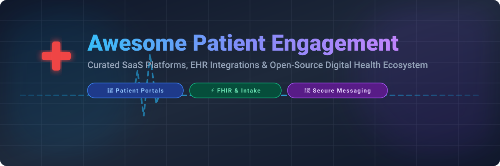

<p align="center">
  
</p>

# 🩺 Awesome Patient Engagement Ecosystem 🚀

<p align="center">
  <a href="https://github.com/ishandutta2007/Awesome-Awesome-Awesome"></a><a href="https://discord.gg/jc4xtF58Ve"></a>
  <a href="https://github.com/ishandutta2007/Awesome-Patient-Engagement"></a>
  <a href="https://github.com/ishandutta2007/Awesome-Patient-Engagement/fork"></a>
  <a href="https://github.com/ishandutta2007"></a>
</p>

> 💡 **A curated directory of SaaS platforms, EHR-integrated digital intake, self-scheduling, telehealth, secure messaging tools, and open-source FHIR components.**

---

## 📑 Table of Contents
- [📊 Market Overview & Industry Insights](#-market-overview--industry-insights)
- [🏢 SaaS/Hosted Platforms](#-saashosted-platforms)
- [💻 Open-Source GitHub Projects](#-open-source-github-projects)
- [🤝 How to Contribute](#-how-to-contribute)
- [⭐ Star History](#-star-history)
- [⚠️ Disclaimer](#%EF%B8%8F-disclaimer)

---

## 📊 Market Overview & Industry Insights 📈

The global **Patient Engagement Platform Market** size is estimated at **~$22 Billion to $32 Billion in 2026** and is projected to expand at a compound annual growth rate (CAGR) of **13% to 21%**, reaching over **$78 Billion+ by the early 2030s**.

> 💡 **Market Dynamics**: The patient engagement software sector is **highly fragmented**. Rather than a single "winner-take-all" platform, the industry consists of specialized SaaS layers competing across niche workflows (appointment reminders, digital intake forms, revenue cycle management, and two-way HIPAA texting) that interface with legacy Electronic Health Record (EHR) systems via HL7 FHIR standards.

---

## 🏢 SaaS/Hosted Platforms 💳

| Product 🏷️ | Company Size (Revenue / Valuation) 💰 | Starting Tier Pricing 🏷️ | Free Tier / Trial Limits ⏱️ | Description 📝 |
| :--- | :--- | :--- | :--- | :--- |
| **[Phreesia](https://www.phreesia.com/)** | **~$500M+ Revenue** (NYSE: PHR) | Baseline packages ~$250–$300/month (Custom quote based on providers) | Full intake platform access free through Dec 31, 2026 (Demo required) | Leading digital intake, registration, and patient engagement platform with payment collection and EHR workflows. |
| **[Solutionreach](https://www.solutionreach.com/)** | **~$250M - $500M Revenue** | Base "Patient Connect" package starting at ~$300–$379/month | No free tier or free trial (Demo available upon request) | Patient communication platform specializing in appointment reminders, recall, and reputation management. |
| **[Weave](https://www.getweave.com/)** | **~$100M - $500M Revenue** (Acquired by Francisco Partners) | "Pro" plan starting at $199–$249/month | No free tier or free trial (Demo available upon request) | All-in-one practice communication combining VoIP phone, texting, payments, and online reviews. |
| **[Artera](https://artera.io/)** | **~$100M CARR** | Enterprise custom pricing starting at ~$500/month equivalent | No free tier or free trial (Demo available upon request) | Enterprise patient messaging platform focused on multi-channel, multi-language outreach for health systems. |
| **[Relatient](https://www.relatient.com/)** | **~$71M Revenue** | Starting tier packages from ~$99/month (Depends on provider volume) | No free tier or free trial (Demo available upon request) | Patient engagement and communication platform supporting messaging, scheduling, and outreach. |
| **[PatientPop](https://www.patientpop.com/)** | **~$35M Revenue** (~$366M Valuation / Tebra) | Practice growth suite starting at ~$300–$500/month per provider | No free tier or free trial (Demo available upon request) | Practice growth and patient engagement platform combining web presence, reputation, and scheduling. |
| **[Luma Health](https://www.lumahealth.io/)** | **~$29M Revenue** (~$500M–$1B Valuation) | Standard starting packages ~$250/user/month | No free tier or free trial (Demo available upon request) | Patient engagement platform for access, self-scheduling, waitlists, reminders, and EHR automation. |
| **[Klara](https://www.klara.com/)** | **~$15M Revenue** (Acquired by ModMed) | Core practice plans starting at ~$125/user/month | No free tier or free trial (Demo available upon request) | Secure patient communication and engagement platform supporting messaging, intake, and care coordination. |
| **[Rhinogram](https://www.rhinogram.com/)** | **~$6.5M Revenue** | Custom practice plans starting at ~$299/month | No free tier or free trial (Demo available upon request) | Secure HIPAA-compliant messaging and virtual engagement solution for practices. |
| **[OhMD](https://www.ohmd.com/)** | **~$5M Revenue** | "Communicate" plan starting at $300/month | No free tier; 14-day limited free trial available on select plans | Two-way texting and patient communication platform designed for practice staff inboxes. |

---

## 💻 Open-Source GitHub Projects 🔓

*Open-source patient engagement projects provide FHIR backends, digital intake forms, and patient portal templates.*

| Repository 📦 | Stars ⭐ | Description 📝 |
| :--- | :--- | :--- |
| **[OpenEMR](https://github.com/openemr/openemr)** | [](https://github.com/openemr/openemr/stargazers) | ONC-certified open-source Electronic Health Records (EHR) & medical practice management platform with built-in patient portal and scheduling. |
| **[Fasten Health](https://github.com/fastenhealth/fasten-onprem)** | [](https://github.com/fastenhealth/fasten-onprem/stargazers) | Open-source self-hosted personal health record (PHR) & patient engagement application connecting medical records across institutions. |
| **[Medplum](https://github.com/medplum/medplum)** | [](https://github.com/medplum/medplum/stargazers) | Developer platform and head-less FHIR server infrastructure for building HIPAA-compliant patient portals, intake forms, and CRM workflows. |
| **[HAPI FHIR](https://github.com/hapifhir/hapi-fhir)** | [](https://github.com/hapifhir/hapi-fhir/stargazers) | Complete Java implementation of the HL7 FHIR standard for building patient portal integrations, messaging routers, and clinical data layers. |
| **[Form.io](https://github.com/formio/formio)** | [](https://github.com/formio/formio/stargazers) | Combined form builder and form server API for creating custom digital intake questionnaires and patient registration forms. |
| **[SMART Sample Patients](https://github.com/smart-on-fhir/sample-patients)** | [](https://github.com/smart-on-fhir/sample-patients/stargazers) | Sample FHIR patient data generator for testing patient portal applications, self-scheduling tools, and engagement prototypes. |
| **[Canvas FHIRStarter](https://github.com/canvas-medical/fhirstarter)** | [](https://github.com/canvas-medical/fhirstarter/stargazers) | Python FastAPI framework for rapidly connecting custom patient engagement apps and portals to FHIR APIs. |
| **[FHIR Works on AWS](https://github.com/aws-solutions/fhir-works-on-aws-deployment)** | [](https://github.com/aws-solutions/fhir-works-on-aws-deployment/stargazers) | Serverless FHIR backend framework on AWS for building scalable patient engagement portals and secure messaging backends. |
| **[Opal](https://github.com/opalmedapps)** | [](https://github.com/opalmedapps) | Open-source patient-in-the-loop data platform sharing health explanations and care plans securely with patients. |

---

## 🛠️ Framework for Building Custom Systems 🧱

```
FHIR Backend (Medplum / HAPI FHIR) ➔ Secure Messaging (Twilio / HIPAA SMS) ➔ Self-Scheduling & Intake (Form.io / Custom UI) ➔ Consent & Audit Logging
```

*Commercial platforms (Phreesia, Luma Health, Weave, Solutionreach, Relatient, etc.) remain the standard choice for clinical practices needing out-of-the-box EHR integration and turnkey HIPAA compliance.*

---

## 🤝 How to Contribute 🌟

Contributions are welcome! Please follow these guidelines:
1. Fork this repository.
2. Add entries to `README.md` maintaining table formatting.
3. Ensure entries link to official websites/repos and describe key healthcare features.
4. For awesome lists curated by the community, visit [Awesome-Awesome-Awesome](https://github.com/ishandutta2007/Awesome-Awesome-Awesome).
5. Submit a Pull Request!

---

## ⭐ Star History

[](https://star-history.dera.page/#ishandutta2007/Awesome-Patient-Engagement&type=date&legend=top-left)

---

## ⚠️ Disclaimer 📜

- This list is community-curated for informational purposes only.
- Systems handling Protected Health Information (PHI) must comply with HIPAA, GDPR, or applicable regional health privacy laws. Open-source deployments require proper encryption, BAA agreements, and security auditing.

---

<p align="center">
  <b>Built with ❤️ for digital health engineers, practice managers, and clinical technology teams.</b>
</p>
